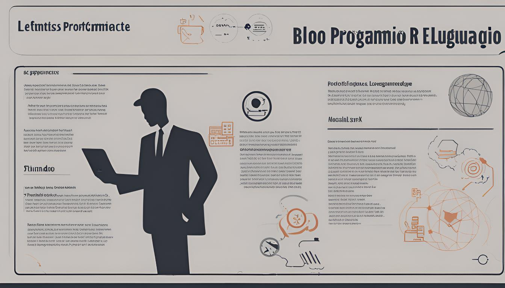

# R Alchemy: Transforming Data Science with Powerful Functions

This repository contains a collection of R functions designed to enhance data science workflows. The functions are organized into various categories to streamline tasks such as data visualization, loading and processing data, modeling, exploratory data analysis (EDA), and reporting.

## Introduction

In the rapidly evolving field of data science, the use of advanced programming techniques and tools is essential for extracting meaningful insights from complex datasets. The R programming language, renowned for its comprehensive suite of statistical functions and packages, has emerged as a cornerstone in this domain. This blog explores the transformative power of R functions and provides an in-depth examination of their application in data science. As we delve into each topic, we aim to equip you with advanced techniques that can significantly enhance your data science workflows.

## Categories

- **Advanced Visualization**: Functions for creating sophisticated visualizations to uncover insights and present data effectively.
- **Data Loading and Processing**: Utilities for importing, cleaning, and transforming data to prepare it for analysis.
- **Data Modeling**: Functions to build and evaluate various models, including statistical and machine learning models.
- **Exploratory Data Analysis (EDA)**: Tools for exploring and understanding data through summary statistics and visualizations.
- **Reporting**: Functions for generating comprehensive reports and summaries to communicate findings.

## Features

- **Modular Functions**: Each function is designed to be modular and reusable, making it easy to integrate into different projects.
- **Documentation**: Detailed documentation and examples are provided for each function to facilitate quick adoption and usage.
- **Customization**: Functions are designed with flexibility in mind, allowing users to customize parameters and settings to fit specific needs.

# Advanced Visualization Techniques

Visualization is the art of representing data in a visual context to make complex patterns and insights more accessible. Advanced visualization techniques in R leverage packages like `ggplot2`, `plotly`, and `shiny` to create interactive and aesthetically pleasing graphics.

### Key Topics:
- **Interactive Graphics with Plotly:** Leveraging `plotly` to create interactive charts that allow users to engage with data in real-time. This includes creating tooltips, zoomable plots, and dynamic updates.
- **Multidimensional Data Visualization:** Implementing techniques to represent data across multiple dimensions using 3D scatter plots, heatmaps, and other advanced graphical representations.
- **Customizing ggplot2 Themes:** Developing bespoke themes in `ggplot2` to tailor the appearance of visualizations to specific project requirements. This encompasses modifying colors, fonts, and overall layout.
- **Data Animations:** Generating animations to illustrate data changes over time, providing a dynamic view of evolving trends and patterns.
- **Building Dashboards with Shiny:** Discover how to create web-based dashboards that provide real-time insights and user interactions.

# Data Loading and Preprocessing

Efficient data loading and preprocessing are critical for preparing datasets for analysis. This stage involves importing, cleaning, and transforming data to ensure it is ready for analysis.

### Key Topics:
- **Efficient Data Loading:** Utilizing packages like `data.table` and `readr` to rapidly load data from various formats (CSV, Excel, SQL databases). Techniques for optimizing performance and managing memory usage will be discussed.
- **Data Import Strategies:** Explore various methods for importing data from different sources, including CSV, Excel, and databases.
- **Data Cleaning Techniques:** Learn advanced techniques for handling missing values, outliers, and inconsistent data entries.
- **Handling Missing Data:** Approaches to identify and address missing values, including imputation methods, data interpolation, and exclusion strategies.
- **Data Transformation:** Utilize functions from packages like `dplyr` and `tidyr` to reshape and manipulate data effectively. Applying transformation techniques such as normalization, standardization, and feature engineering to prepare data for modeling. This includes creating new derived variables and scaling features.
- **Data Integration:** Merging datasets from disparate sources and formats to create a unified dataset. This involves techniques for data merging, alignment, and consistency checks.

# Data Modeling

Data modeling involves applying statistical and machine learning techniques to build predictive models. R provides a robust environment for developing, evaluating, and fine-tuning these models.

### Key Topics:
- **Linear and Non-Linear Regression Models:** Understand the fundamentals of regression analysis and how to apply it to various types of data.

## Classification Models

**Classification models** are used to categorize data into predefined classes or categories based on features. These models are essential for tasks such as predicting whether an email is spam or not, diagnosing diseases based on symptoms, and more.

### Key Topics:
- **Decision Trees:** Understand how decision trees work, including the process of splitting nodes based on feature values to make predictions.
- **Random Forests:** Learn how random forests combine multiple decision trees to improve classification accuracy and robustness.
- **Support Vector Machines (SVM):** Explore how SVMs find the optimal hyperplane that separates different classes in a high-dimensional space.
- **Model Evaluation:** Evaluate classification models using metrics such as accuracy, precision, recall, F1 score, and ROC curves.

## Clustering Models

**Clustering models** are used to group similar data points into clusters, where data points in the same cluster are more similar to each other than to those in other clusters. These models are useful for discovering hidden patterns and structures in data.

### Key Topics:
- **K-Means Clustering:** Learn how k-means clustering partitions data into k clusters by minimizing the variance within each cluster.
- **Hierarchical Clustering:** Explore hierarchical clustering methods that build a hierarchy of clusters using agglomerative or divisive techniques.
- **Evaluation and Validation:** Assess clustering results using metrics such as silhouette score and Dunn index to determine the quality and validity of the clusters.
- **Model Evaluation and Tuning:** Learn how to assess model performance using metrics such as ROC curves, confusion matrices, and cross-validation.
- **Regression Models:** Building linear and nonlinear regression models, including penalized regression techniques such as Lasso and Ridge regression to handle multicollinearity and enhance model performance.
- **Cross-Validation:** Applying cross-validation techniques to ensure the robustness and generalizability of models, including k-fold cross-validation and stratified sampling.

# Exploratory Data Analysis

Exploratory Data Analysis (EDA) is an essential phase of the data analysis process that involves summarizing the main characteristics of a dataset, often using visual methods.

### Key Topics:
- **Descriptive Statistics:** Generating summary statistics and gaining insights into data distributions, including measures of central tendency, dispersion, and variability.
- **Univariate and Bivariate Analysis:** Explore relationships between variables and identify patterns through scatter plots, histograms, and box plots.
- **Advanced EDA Techniques:** Utilize techniques such as dimensionality reduction (PCA) and feature engineering to uncover deeper insights.
- **Anomaly Detection:** Identifying outliers and unusual patterns in data using statistical tests and visualization techniques such as boxplots and scatter plots.
- **Distribution Visualization:** Creating histograms, density plots, and boxplots to explore the distribution of variables and assess their characteristics.
- **Correlation and Covariance Analysis:** Examining relationships between variables using correlation matrices, scatter plot matrices, and covariance analysis to understand the interdependencies among features.

# Generating Reports

Effective communication of findings is crucial in data science. R provides several tools for generating comprehensive reports that present results in a clear and engaging manner.

### Key Topics:
- **Dynamic Reports with R Markdown:** Using `rmarkdown` to create reproducible reports that combine narrative text, code, and results in a single document. This includes techniques for embedding code and visualizations seamlessly.
- **Interactive Reports with Shiny:** Explore the creation of interactive reports that allow users to interact with data visualizations and analyses.
- **Automated Reporting:** Setting up scripts to automatically generate reports from updated datasets, ensuring that stakeholders receive the latest insights without manual intervention.
- **Incorporating Visualizations in Reports:** Integrating graphics and tables into reports to provide a visual representation of findings, enhancing clarity and impact.
- **Exporting to Various Formats:** Generating reports in formats such as PDF, HTML, and Word to cater to different audiences and presentation needs.

# Additional Topics

To provide a more holistic view of R's capabilities, we will also cover the following advanced topics:

- **Advanced Time Series Analysis:** Techniques for modeling and forecasting time series data.
- **Handling Big Data with R:** Strategies for working with large datasets using packages like `data.table` and `sparklyr`.
- **Integrating R with Other Tools:** Explore how to integrate R with SQL, Python, and cloud platforms to enhance data workflows.
- **Advanced Statistical Methods:** In-depth exploration of Bayesian analysis, survival analysis, and multivariate statistics.

# Conclusion

Mastering advanced R functions is crucial for any data scientist aiming to leverage the full potential of their data. This blog aims to provide you with the knowledge and tools needed to excel in this dynamic field. By exploring advanced visualization techniques, data preprocessing methods, modeling strategies, and reporting tools, you will be well-equipped to tackle complex data challenges and drive meaningful insights.


## Installation

To use these functions, you can either clone the repository or install it directly from GitHub:

```r
devtools::install_github("your-username/your-repo-name")
```
## Usage
Please refer to the documentation within each function for examples and detailed usage instructions.

## Contributing
Contributions are welcome! If you have suggestions or improvements, please open an issue or submit a pull request.

## License
This project is licensed under the MIT License - see the LICENSE file for details.


¡Espero que te sea útil!

